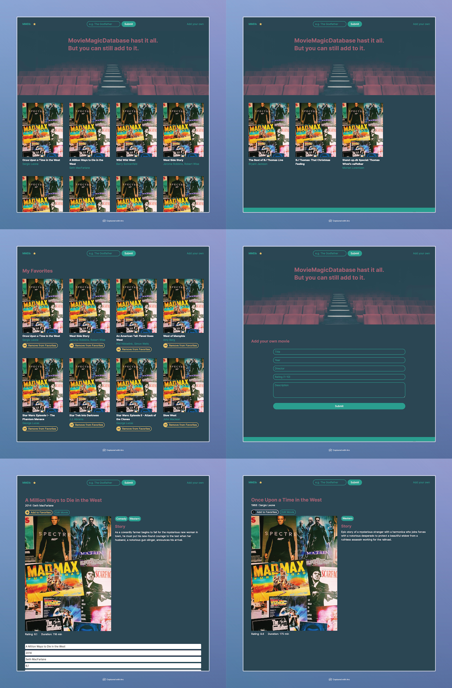

# Project: Fullstack Movie Database App MERN

## Purpose of the App

- Search the database for movies
- View detailed information on all movies on the details page
- Edit the information of the films on the details page
- Add your favorite films as favorites
- Delete films from your favorites
- View all your favorites on the favorites page
- Create new movies to be added to the database

## Built with

- React
- React Router DOM
- Node.js
- Express.js
- MongoDB
- Mongoose
- RESTful API
- TailwindCSS
- Desktop only

## Links

- [GitHub Repository](https://github.com/thomaserdmenger/Movie-Database-MERN)
- [GitHub Author](https://github.com/thomaserdmenger)
- [LinkedIn Author](https://www.linkedin.com/in/thomaserdmenger/)

## Screenshot-Image

